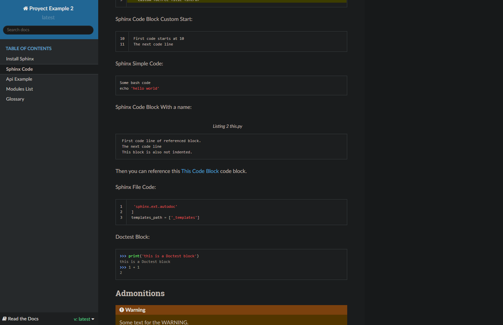

<br />
<div align="center">
	<a href="Repo Link">
		
	</a>
	<h3 align="center">Sphinx Docs Tutorial</h3>
	<p align="center">
    	Example documentation and cheatsheet of this amazing python tool.
    	<br />
    	<a href="https://github.com/othneildrew/Best-README-Template"><strong>Explore the docs »</strong></a>
    	<br />
  	</p>
</div>


## About

By going over the [Sphinx Docs](https://www.sphinx-doc.org/en/master/) in an attempt to learn how to document my code I inadvertently ended up making a tutorial about the documentation tool itself and a starting point for creating my own documentation in the future.

## Installation

1. Download and install [python](https://www.python.org/downloads/)
2. Clone the repo
	```sh
	git clone https://github.com/DarioArzaba/Sphinx-Docs-Tutorial
	cd Sphinx-Docs-Tutorial
	```

## Usage

You can build the project and look at the code to learn how to:

1. Install Sphinx
2. Create Restructured-Text files (Similar to markdown)
3. Create a page dedicated to the API of your program.
1. Create pages dedicated to the modules of your program.
1. Create a Glossary of terms used in your documentation.

</br>
<div align="center"> <p> Read the Docs theme </p> </div>


## Roadmap

- [x] Done base tutorial
- [ ] Update the project from 2019
- [ ] Add Advanced Section
    - [ ] Modifying the Theme
    - [ ] Making a Sphinx Extension

## License

Distributed under the [MIT License](https://mit-license.org/).

## Contact

Dario Arzaba - dario.arzaba@gmail.com